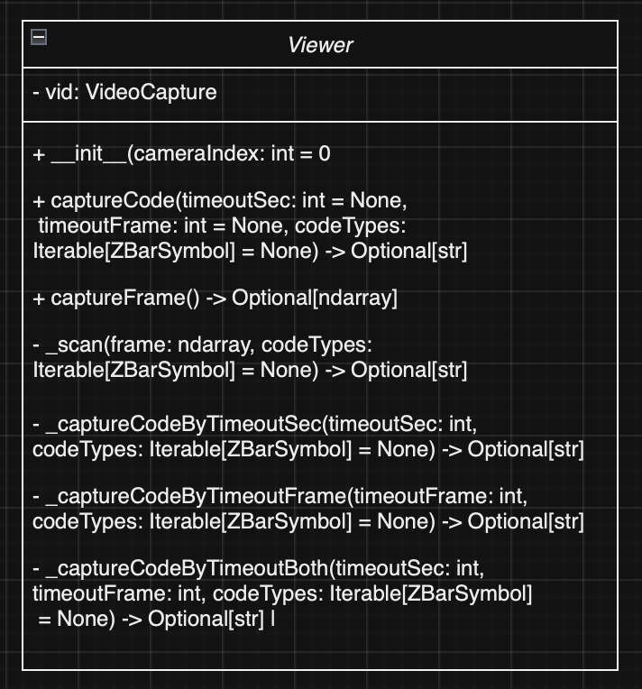

# Vision Common
Common package for visual processing. Contains classes and methods for capturing frames from a camera, and reading codes from them. The goal being a user-friendly way to process images for non-technical users.

## Table of Contents
- [Installation](#installation)
- [Usage](#usage)
- [Contributing](#contributing)
- [License](#license)

## Installation
To install this package, use the commands `pip install git+https://github.com/ECU-ATMAE-ROBOTICS/VisionCommon`


## Usage
### Capture Code With Timeout functionality
- Use timeoutFrame to timeout after n frames instead of n seconds
- Using both will simply timeout whichever one finishes first
```python
viewer = Viewer(cameraIndex=0)

decoded_content = viewer.captureCode(timeoutSec=10)
if decoded_content:
    print("Decoded content:", decoded_content)
else:
    print("No code detected within the specified time.")
```

### Capture A Single Frame
```python
import cv2

viewer = Viewer(cameraIndex=0)

frame = viewer.captureFrame()
if frame is not None:
    cv2.imshow("Captured Frame", frame)
    cv2.waitKey(0)
    cv2.destroyAllWindows()
else:
    print("Failed to capture a frame from the camera.")
```

## Contributing
Please ensure your pull request adheres to the following guidelines:

- Keep descriptions short and simple, but descriptive.
- Check your spelling and grammar.
- Make sure your code follows the style guide of this project.
- Ensure your code does not generate any new warnings or errors.

If you find a bug, kindly open an issue.

Any contributions you make will be under the GPL-3 License. In submitting a pull request, you agree to license your work under the same license.

For major changes, please open an issue first to discuss what you would like to change.

## License
This project is licensed under the GPL-3 License - see the [LICENSE](LICENSE) file for details.

## Docs


